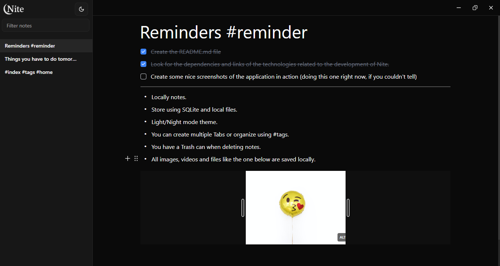
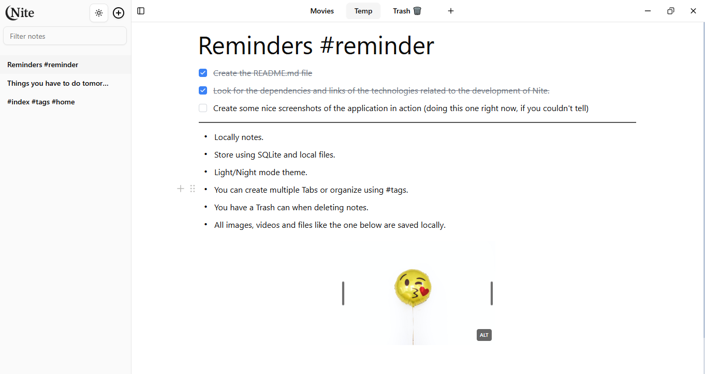

## Nite

A simple desktop app to take notes quickly and efficiently. Inspired by the simplicity and offline capabilities of [Obsidian](https://obsidian.md/) and the ease-of-use [Notion](https://www.notion.com/) has, Nite aims to be a mix of both but focused to be used as a modern alternative of Notepad which means being simple and minimalistic but being powerful enough for the majority of users.

### Screenshots

---





### How does it work?

---

The application is built using [Wails 2](https://wails.io/) framework, which uses Go and the native rendering engine of the platform executing the application which results in a very small runtime. The frontend is build using React.js and Tailwind CSS. For the editor it uses [Yoopta Editor](https://yoopta.dev/) and every single file and asset use in the application is saved locally in the user’s machine, so having internet connection is not required. A local SQLite database file is created and used to make searching notes quicker.

### How to get the project?

---

You can either download one of the [GitHub Releases](https://github.com/Gregor-VM/Nite/releases) or build the project on your one as shown next.

### How to build the project?

---

Start by simply cloning this repo and making sure to have installed [Go](https://go.dev/dl/), [Wails 2](https://wails.io/), [Node.js](https://nodejs.org/en/download) and [PNPM](https://pnpm.io/installation) on your machine. Then run:

```bash
wails build
```

Or if you want to run the application in developer mode, run:

```bash
wails dev
```

For now, I have only developed and tested the application using Windows. But it should run on Linux and MacOS as well.

### Contributing

---

Feel free to contribute to this project by either creating an issue or a pull request.

If you feel or don’t feel like contributing right now, a nice star ⭐ will go a long way!
